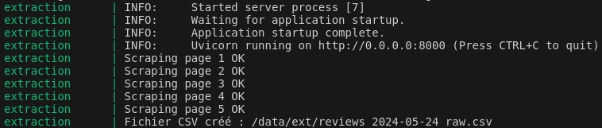
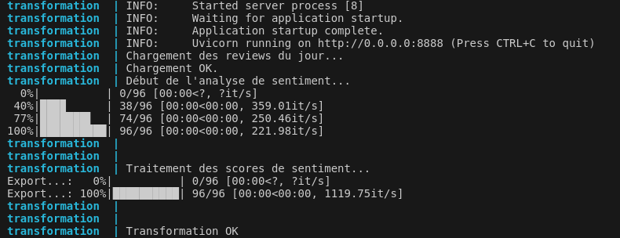
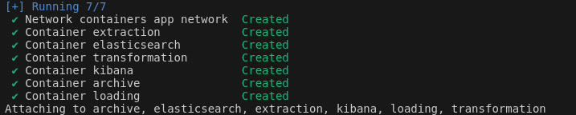

# CDE_Satisfaction2023
### Projet Satisfaction Client - Cdiscount/Trustpilot

Repository GitHub concernant le projet "Satisfaction Client" proposé par DataScientest pour la promotion Data Engineer de Juillet 2023 Continue

#### *Chef de projet : Sebastien SIME - DataScientest*
#### *Membre : Joris BENOIT*


## Comment pourrait-on évaluer la qualité du service client de Cdiscount à travers le site Trustpilot ?
#### Objectif : S'assurer à l'aide de différentes métrics (taux de réponse, satisfaction client, keywords..) de la qualité du service client de Cdiscount et de la conformité des avis laissés.

#### *Méthodologie*

Ce projet développe et met en œuvre un pipeline ETL simple pour extraire, transformer et charger des données issues du site 'Trustpilot'. 
Après le traitement des données, celles-ci sont indexées dans ElasticSearch puis exposées via Kibana, un outil de visualisation open source permettant une analyse et une visualisation intéractives.

Le projet s'éxecute de facon quotidienne et automatisée.
Des logs sont disponibles pour s'assurer que les services fonctionnent correctement :





1. **Installation du projet - Projet Testé et Installé dans une machine virtuelle hebergée sur un serveur FreeboxDelta utilisant la distribution Ubuntu Jammy 22.04.4 LTS**
```bash

# Clonage du repository 
git clone https://github.com/Kodakh/CDE_Satisfaction2023/tree/release


# Lancement du script bash pour l'installation des dépendances + création des images 
cd CDE_Satisfaction2023
./run.sh
cd src
cd containers
docker-compose up -d

```


2. **Architecture du projet "CDE_Satisfaction2023"**

Le projet s'articule autour de 7 micro-services construit via des images Dockerfiles spécifiques pour chaque étape du pipeline ETL, conditionnés avec des wrappers & healthchecks, ainsi qu'un fichier docker-compose.yml pour orchestrer le déploiement de ces services :
1. *Archive* => Charge en memoire l'historique des reviews pre-2024 (+ de 120 000 avis)
2. *Extraction* => Scraping des reviews
3. *Tranformation* => Cleaning & valorisation des données extraites
4. *Loading* => Chargement et indexation des données transformées dans le SGBD
5. *ElasticSearch* => Moteur de recherche pour les données 
6. *Kibana* => Visualisation et interprétation a l'aide d'un Dashboard
7. *Network* => réseau partagé par l'ensemble des containers pour faire passerelle entre chaque service




```bash
.
├── README.md
├── Report
│   └── Rendu Rapport Etape 1 - SC DIACOH - BELKHIR - BENOIT.rtf
├── requirements.txt
├── run.sh
└── src
    ├── containers
    │   ├── Dockerfile.archive
    │   ├── Dockerfile.extraction
    │   ├── Dockerfile.loading
    │   ├── Dockerfile.transformation
    │   └── docker-compose.yml
    ├── doc
    └── scripts
        ├── archive
        │   ├── A0.py
        │   └── data
        │       └── archive_raw.csv
        ├── extract
        │   ├── E0.py
        │   ├── healthcheck_extract.py
        │   └── wrapper_extraction.py
        ├── load
        │   ├── L0.py
        │   └── wrapper_loading.py
        └── transform
            ├── T0.py
            ├── healthcheck_transform.py
            └── wrapper_transformation.py

10 directories, 19 files


```


3. **Vision finale du Dashboard :**


