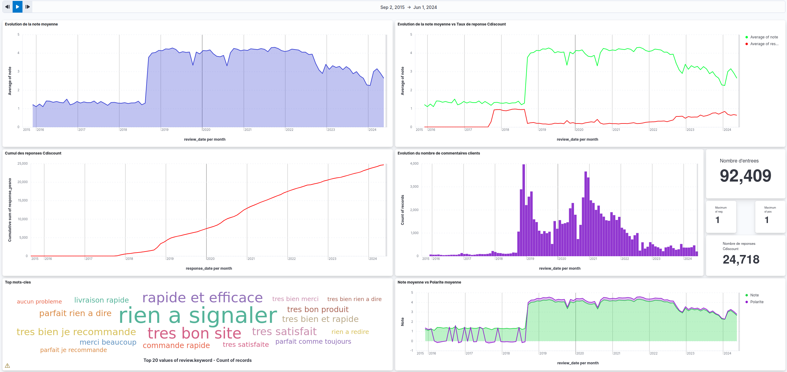

# CDE_Satisfaction2023
Projet Satisfaction Client - CDE 2023

Repository GitHub concernant le projet "Satisfaction Client" proposé par DataScientest pour la promotion Data Engineer de Juillet 2023 Continue

Chef de projet : Sebastien SIME - DataScientest
Membre : Joris BENOIT

Problématique posée : <span style="color: red;">Comment pourrait-on évaluer la qualité du service client de Cdiscount à travers le site Trustpilot ?</span>
Objectif : S'assurer à l'aide de différentes métrics (taux de réponse, satisfaction client, keywords..) de la qualité du service client de Cdiscount et de la conformité des avis laissés.


I. Installation du projet - Testé sur Ubuntu Jammy 22.04.4 LTS
```bash

# Clonage du repository 
git clone https://github.com/Kodakh/CDE_Satisfaction2023/tree/release


# Lancement du script bash pour l'installation des dépendances + création des images 
cd CDE_Satisfaction2023
./run.sh
cd src
cd containers
docker-compose up 

```

II. Vision finale du Dashboard :




III. Architecture du projet "CDE_Satisfaction2023"

```bash
.
├── README.md
├── Report
│   └── Rendu Rapport Etape 1 - SC DIACOH - BELKHIR - BENOIT.rtf
├── requirements.txt
├── run.sh
└── src
    ├── containers
    │   ├── Dockerfile.archive
    │   ├── Dockerfile.extraction
    │   ├── Dockerfile.loading
    │   ├── Dockerfile.transformation
    │   └── docker-compose.yml
    ├── doc
    └── scripts
        ├── archive
        │   ├── A0.py
        │   └── data
        │       └── archive_raw.csv
        ├── extract
        │   ├── E0.py
        │   ├── healthcheck_extract.py
        │   └── wrapper_extraction.py
        ├── load
        │   ├── L0.py
        │   └── wrapper_loading.py
        └── transform
            ├── T0.py
            ├── healthcheck_transform.py
            └── wrapper_transformation.py

10 directories, 19 files


```
